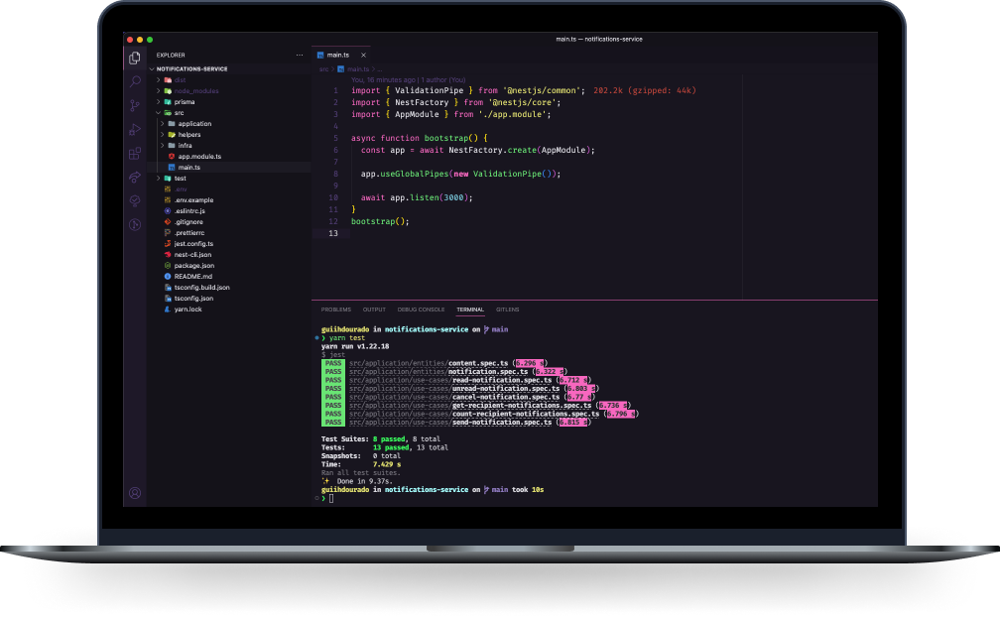

<h1 align="center">
  Notifications Service
</h1>

  <a href="#-tecnologias">Tecnologias</a>&nbsp;&nbsp;&nbsp;|&nbsp;&nbsp;&nbsp;
  <a href="#-projeto">Projeto</a>&nbsp;&nbsp;&nbsp;|&nbsp;&nbsp;&nbsp;
  <a href="#-como-executar">Como executar</a>&nbsp;&nbsp;&nbsp;

 

  

## ✨ Tecnologias

Esse projeto foi desenvolvido com as seguintes tecnologias:

- [NestJS](https://nestjs.com/)
- [Prisma](https://www.prisma.io/)
- [TypeScript](https://www.typescriptlang.org/)

## 💻 Projeto

Microsserviço de notificações desenvolvido no Ignite Lab 04 de Node.js - [Rocketseat](https://www.rocketseat.com.br/)

## 🚀 Como executar

- Clone o repositório
- Instale as dependências com `yarn`
- Inicie o servidor com `yarn start:dev`

---

Feito por [Gui Dourado](https://guidourado.dev) 🚀